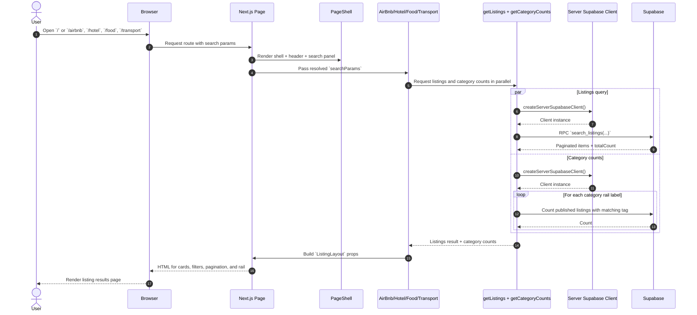
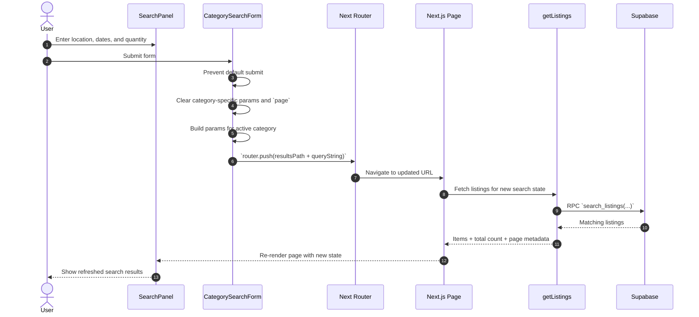
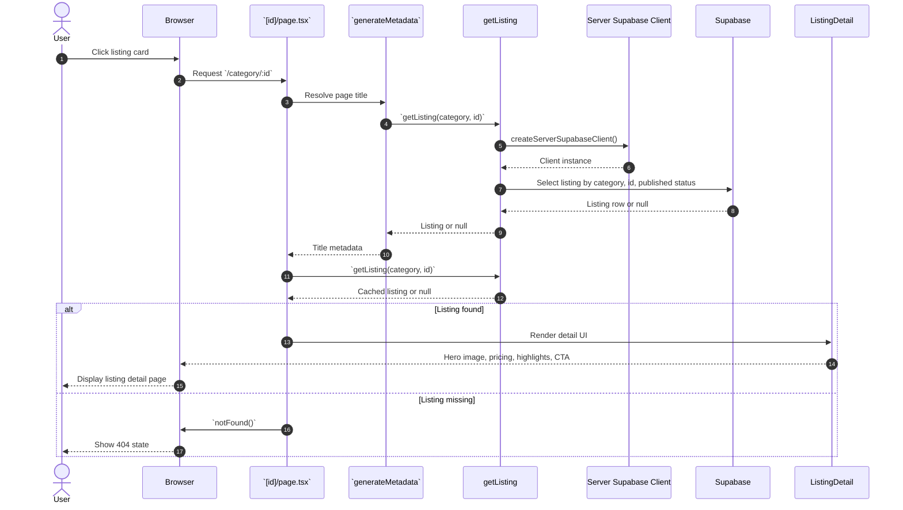
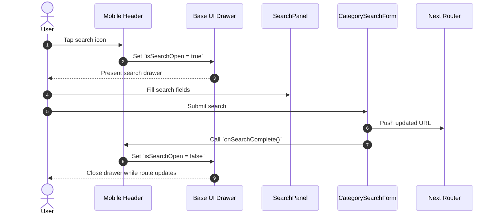

# Tourz Sequence Diagrams

These diagrams are based on the current app structure in `app/`, `lib/listings/queries.tsx`, and `lib/supabase/server.ts`.

## 1. Browse Listings From Home Or Category Page

## 2. Submit Search From Search Panel

## 3. Open A Listing Detail Page

## 4. Mobile Search Drawer Flow

## Notes

- The home page currently routes through `app/page.tsx` and renders the Airbnb results experience by default.
- Listing search uses the `search_listings` Supabase RPC for paginated results.
- Listing detail pages use `getListing(...)` and return `notFound()` when no published record exists.
- Search behavior differs slightly by category:
  - `transport` uses `pickup`, `dropoff`, `pickupDate`, and `returnDate`
  - `food` uses `where`, `date`, `time`, and `partySize`
  - `hotel` uses `where`, `checkIn`, `checkOut`, and `rooms`
  - `airbnb` uses `where`, `checkIn`, `checkOut`, and `guests`
