# Tourz Sequence Diagrams

These Mermaid sequence flows describe the implemented TourzApp journeys. Open this document in a Mermaid-enabled Markdown viewer to see the diagrams.

Flows 1–6 cover discovery, search, authentication, and wishlists; 7 covers checkout and safe retries; 8–9 cover listing creation and settings; 10–13 cover provider profiles, dashboards, listing availability, and booking fulfillment.

## 1. Browse Listings From Home Or Category Page

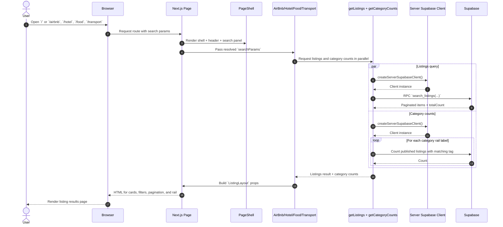

## 2. Submit Search From Search Panel

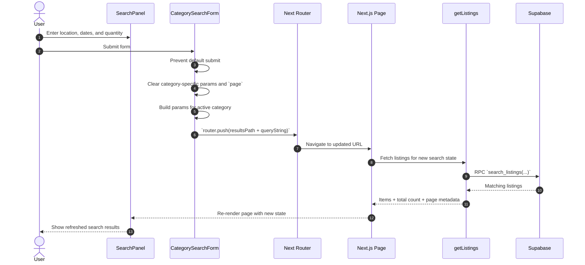

## 3. Open A Listing Detail Page

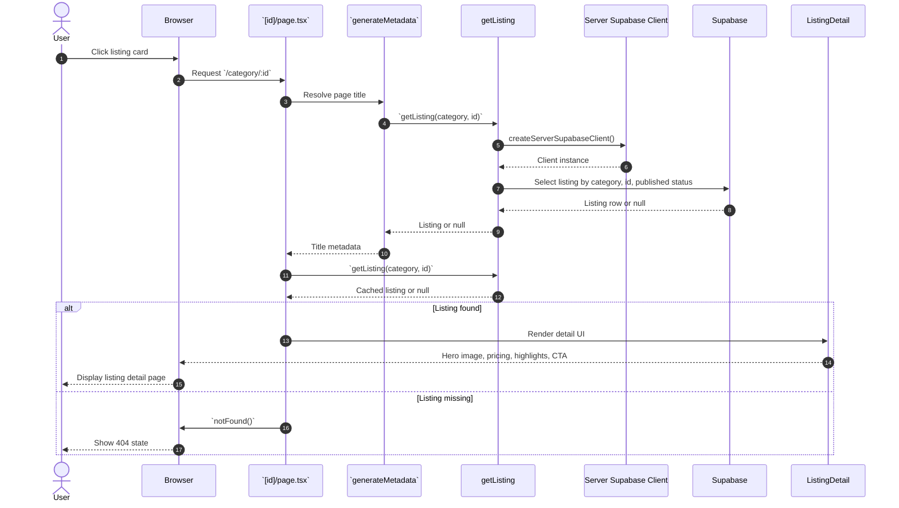

## 4. Mobile Search Drawer Flow

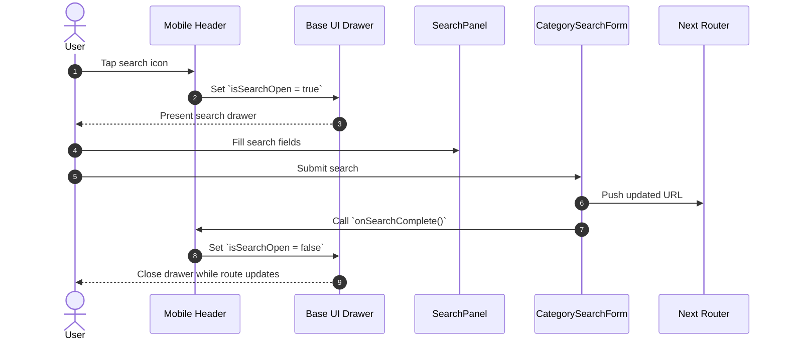

## 5. Sign In And OAuth Callback

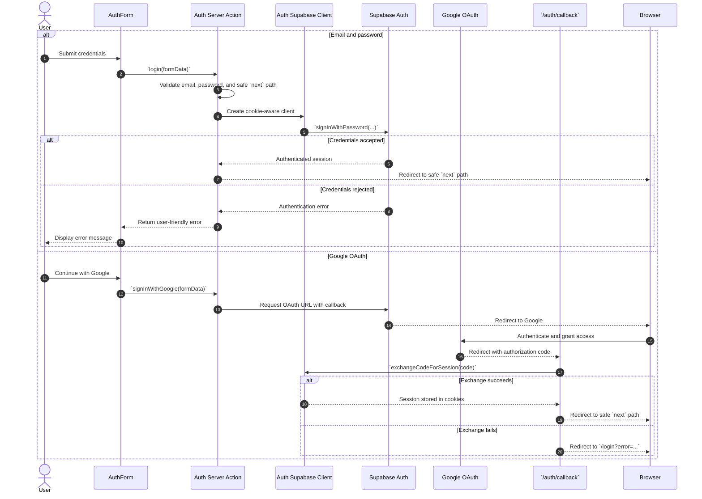

## 6. Save And Synchronize A Wishlist Item

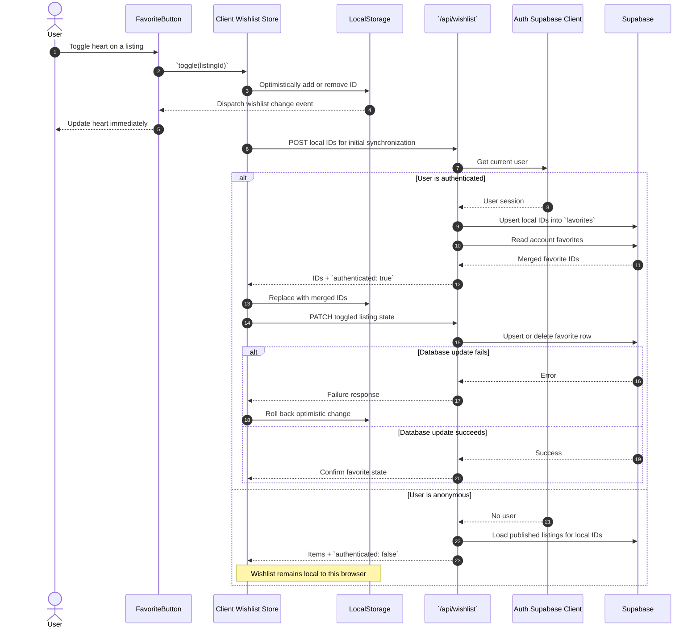

## 7. Complete A Reservation And Retry Safely

Source: `app/checkout/[category]/[id]/page.tsx`, `app/checkout/actions.ts`, `lib/reservations/attempt.ts`.

```mermaid
sequenceDiagram
    autonumber
    actor Traveler
    participant Checkout as Checkout page / form
    participant Auth as Supabase Auth
    participant Action as createReservation
    participant DB as Supabase database
    participant Confirmation as Reservation page

    Traveler->>Checkout: Open checkout for a listing
    opt Missing or invalid attempt UUID
        Checkout-->>Traveler: Redirect to checkout URL with new attempt UUID
        Traveler->>Checkout: Open URL with persistent attempt UUID
    end
    Checkout->>Auth: Verify signed-in user
    alt No authenticated user
        Checkout-->>Traveler: Redirect to login, preserving checkout URL
    else Authenticated
        Checkout->>DB: Find reservation by attempt ID, user, and listing
        alt Reservation already exists
            Checkout-->>Traveler: Redirect to existing reservation
        else No existing reservation
            Checkout->>DB: Load published listing
            Checkout-->>Traveler: Show checkout or 404 if missing
            Traveler->>Action: Submit details, pay_later, and same attempt ID
            Action->>Action: Validate attempt, payment option, dates, category, and party size
            Action->>Auth: Verify user again
            Action->>DB: Find existing reservation for this attempt
            alt Existing reservation found
                DB-->>Action: Existing reservation ID
            else No existing reservation
                Action->>DB: Re-fetch published listing and authoritative price
                Action->>Action: Calculate totals from validated dates and listing price
                Note over Action: Stays and transport use duration plus 8% fee.<br/>Food subtotal, fee, and total are zero.
                Action->>DB: Insert with attempt UUID as primary key
                Note over Action,DB: status=confirmed, payment_method=pay_later,<br/>payment_status=not_charged
                alt Insert succeeds
                    DB-->>Action: Reservation ID
                else Insert returns error or missing result
                    Action->>DB: Recheck attempt ID, user, and listing
                    DB-->>Action: Existing ID, no match, or lookup error
                end
            end
            alt Reservation ID established
                Action-->>Confirmation: Redirect to reservation
                Confirmation-->>Traveler: Show reservation details
            else Outcome unknown or network exception
                Action-->>Traveler: Retry from same checkout or check My reservations
                Note over Traveler,DB: Reloads and retries retain the attempt ID.<br/>Primary key prevents duplicate insertion; existing rows are never overwritten.
            end
        end
    end
    Note over Action,DB: Validation, authentication, or availability failures return an error before insertion.<br/>A published listing check does not implement inventory locking or payment collection.
```

## 8. Create A Host Listing Draft

Source: `app/host/onboarding/actions.ts`.

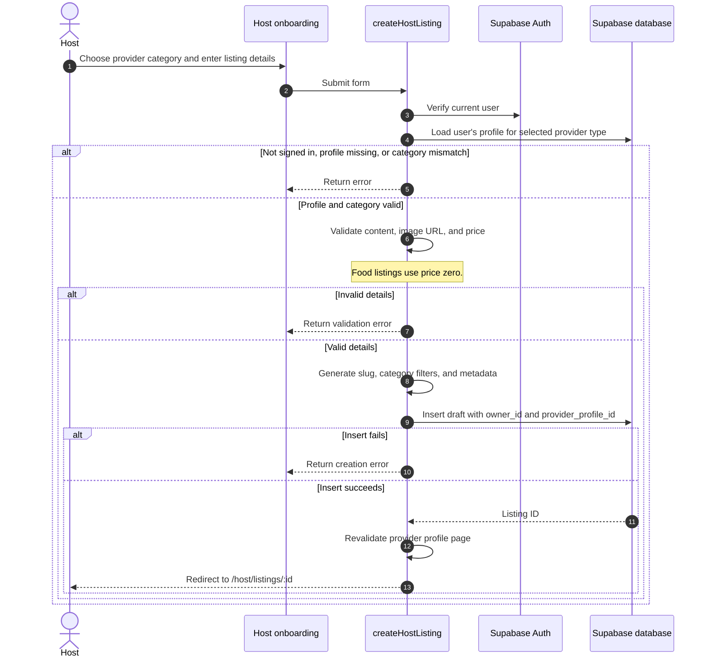

## 9. Save Profile, Travel, And Host Settings

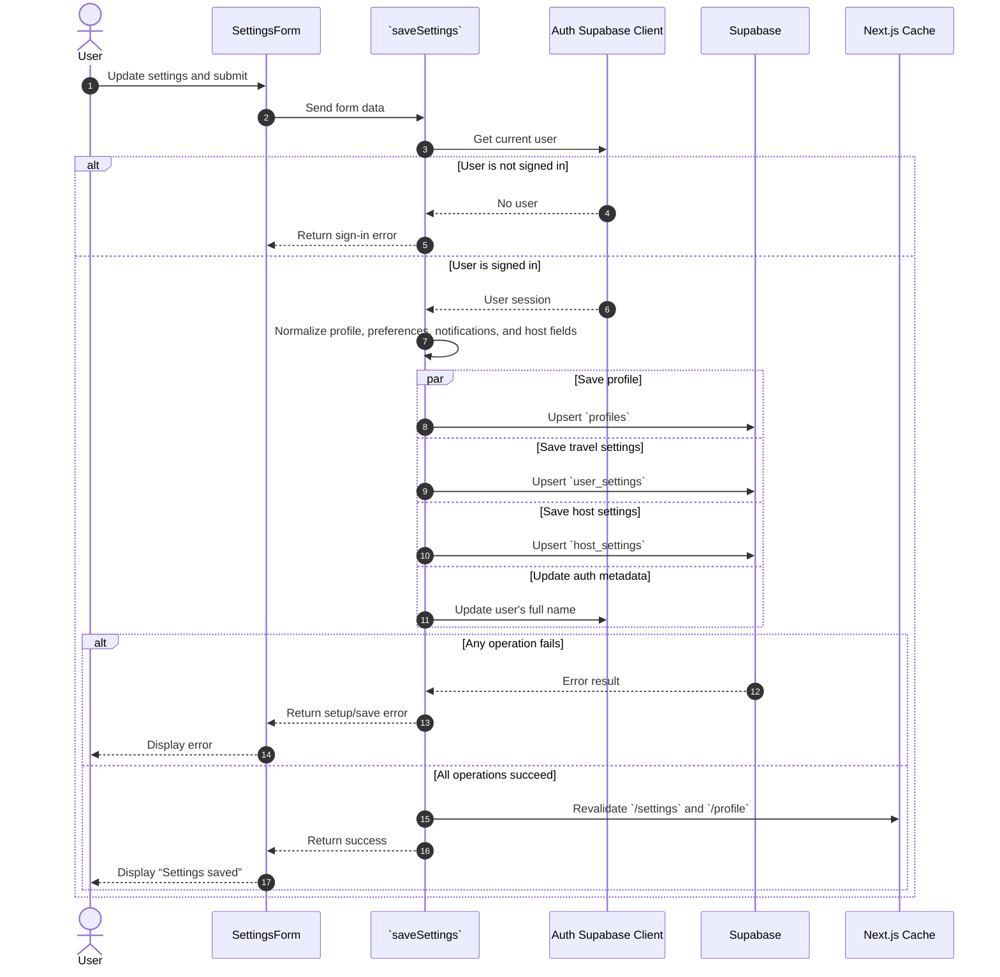

## 10. Create Or Edit A Provider Profile

Source: `app/host/profiles/actions.ts`.

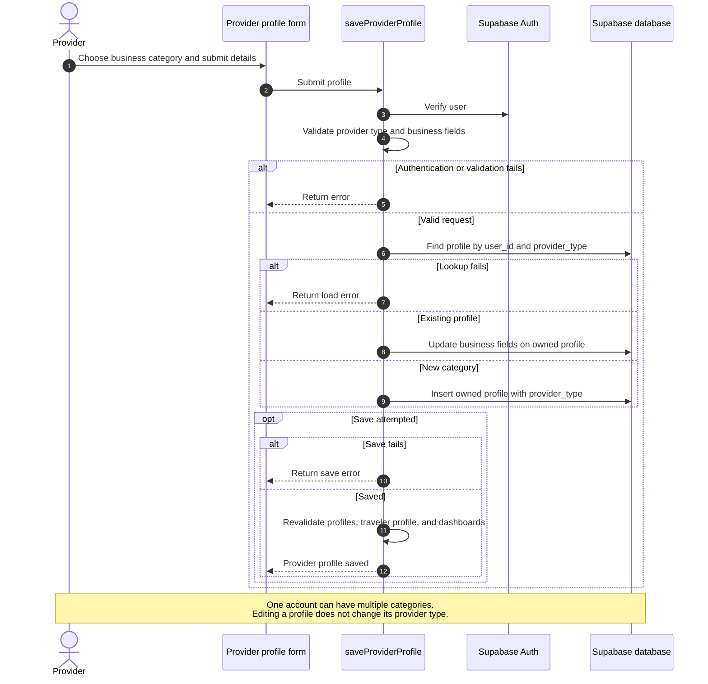

## 11. Open And Switch Provider Dashboards

Source: `app/host/dashboard/page.tsx`, `app/host/dashboard/[type]/page.tsx`, `lib/providers/account.ts`.

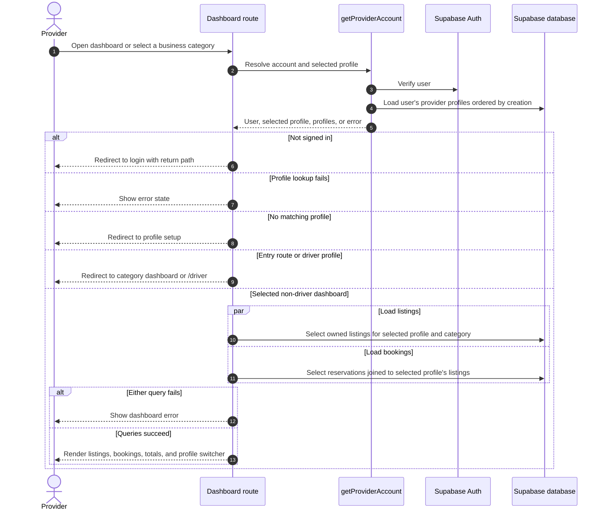

## 12. Edit, Publish, Or Pause A Provider Listing

Source: `app/host/dashboard/actions.ts`.

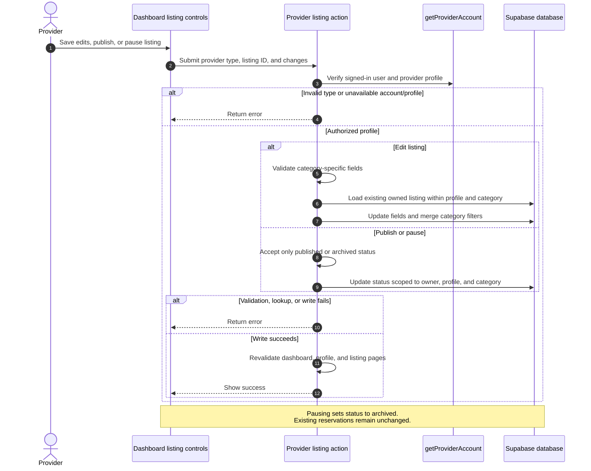

## 13. Confirm, Start, Complete, Or Cancel A Booking

Source: `app/host/dashboard/actions.ts`, `lib/driver/types.ts`. The Driver dashboard has corresponding actions in `app/driver/actions.ts`.

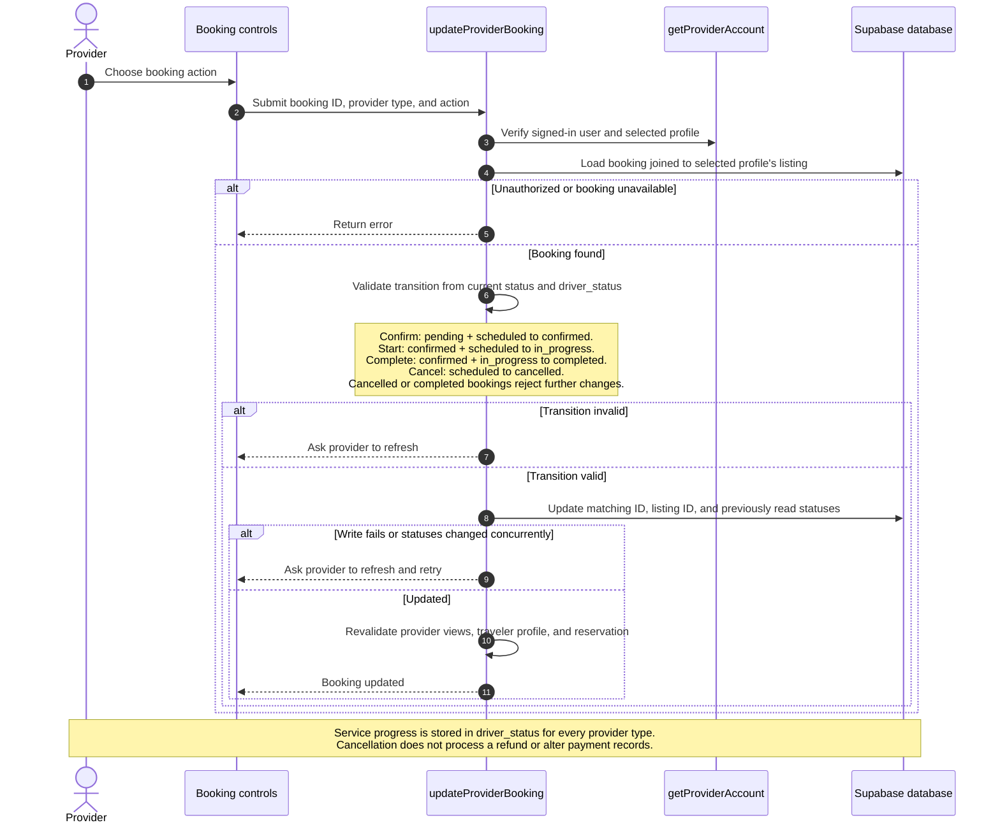

## Notes

- The home page currently routes through `app/page.tsx` and renders the Airbnb results experience by default.
- Listing search uses the `search_listings` Supabase RPC for paginated results.
- Listing detail pages use `getListing(...)` and return `notFound()` when no published record exists.
- Search behavior differs slightly by category:
  - `transport` uses `pickup`, `dropoff`, `pickupDate`, and `returnDate`
  - `food` uses `where`, `date`, `time`, and `partySize`
  - `hotel` uses `where`, `checkIn`, `checkOut`, and `rooms`
  - `airbnb` uses `where`, `checkIn`, `checkOut`, and `guests`
